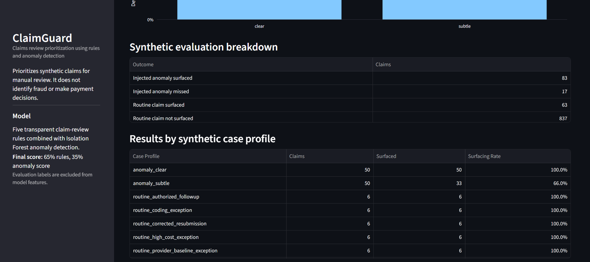
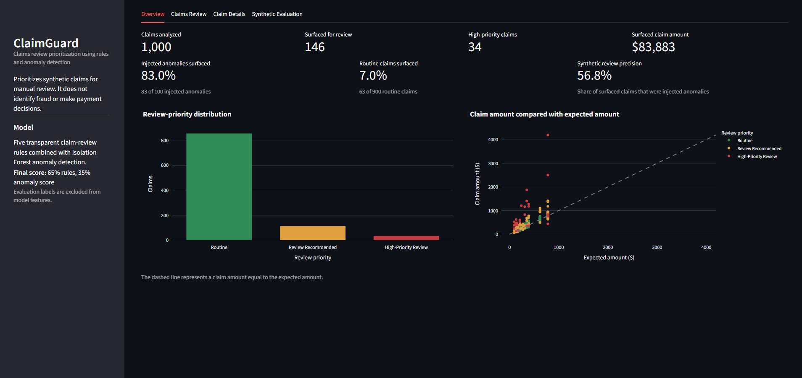
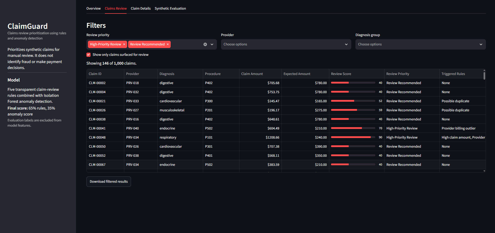
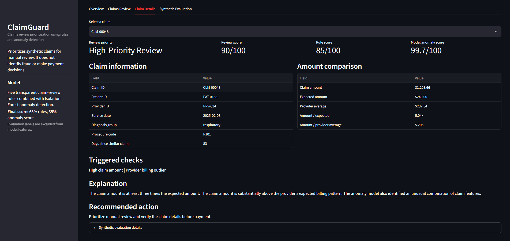
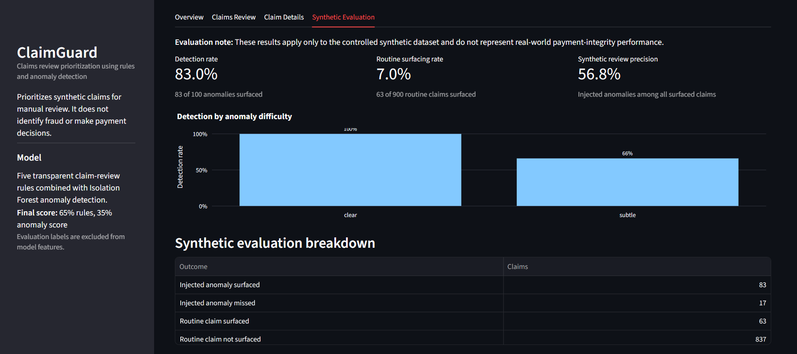

# ClaimGuard

**ClaimGuard** is an explainable healthcare claims-review prioritization proof of concept. It combines transparent rule-based checks with unsupervised anomaly detection to surface synthetic claims that may warrant additional human review.

**Topic: Clinical Decision Making and Pattern Recognition in Health Care**.

The accompanying research examines applications across **Treatment, Payment, and Operations (TPO)**. The working prototype intentionally focuses on **Payment** as a narrow, testable implementation of the broader pattern-recognition workflow.

---

## Project Scope

The research portion of this assessment considers pattern recognition and decision support across:

- **Treatment** — patient risk, care planning, deterioration detection, and clinical decision support
- **Payment** — unusual claim patterns, coding/utilization mismatches, provider outliers, and claims-review prioritization
- **Operations** — demand forecasting, staffing pressure, capacity planning, and resource allocation

ClaimGuard implements the **Payment** portion as a focused proof of concept.

ClaimGuard does **not** determine fraud and does **not** make automatic payment decisions. It prioritizes claims for human review, explains the signals behind each result, and recommends an appropriate review action.

---

## How ClaimGuard Works

ClaimGuard follows a simple, reproducible workflow:

1. Generate a fixed-seed synthetic claims dataset.
2. Calculate comparison features such as expected claim amount and provider-level billing behavior.
3. Apply five transparent review rules.
4. Score broader patterns using an **Isolation Forest** anomaly-detection model.
5. Combine rule-based and anomaly-based signals into a single review score.
6. Assign each claim a review priority.
7. Generate a plain-language explanation and recommended next step.
8. Present the results in an interactive **Streamlit** dashboard.

---

## Review Signals

The rule engine checks for:

- High claim amounts
- Possible duplicate submissions
- Frequent repeat services
- Provider billing outliers
- Simplified diagnosis-procedure mismatches

The final review score combines the two signal types as:

```text
65% rule score + 35% anomaly score
```

Claims are grouped into three review outcomes:

- **Routine**
- **Review Recommended**
- **High-Priority Review**

The purpose of the combined score is to prioritize reviewer attention while keeping the final decision with a human reviewer.

---

## Technology Stack

- **Python**
- **pandas**
- **scikit-learn**
- **Streamlit**
- **pytest**

The implementation intentionally uses a small technology stack to keep the proof of concept simple, reproducible, and easy to review.

---

## Synthetic Dataset

ClaimGuard uses a reproducible synthetic dataset containing **1,000 claims**:

- **100 injected anomalies**
  - 50 clear anomalies
  - 50 subtle anomalies
- **30 legitimate edge cases**
- **870 standard routine claims**

A fixed random seed is used so that the generated dataset and evaluation are reproducible.

Evaluation labels are excluded from model features to avoid label leakage.

### Synthetic Case Profiles

The controlled dataset includes routine claims, legitimate edge cases, clear anomalies, and subtle anomalies to test how the review workflow behaves across different claim patterns.

<p align="center">
  
</p>

---

## Synthetic Evaluation Results

On the fixed synthetic dataset, ClaimGuard surfaced:

- **83 of 100 injected anomalies — 83%**
- **63 of 900 routine claims — 7%**
- **50 of 50 clear anomalies — 100%**
- **33 of 50 subtle anomalies — 66%**
- **146 total claims surfaced for review**
- **34 high-priority claims**
- **56.8% synthetic review precision**

Synthetic review precision is calculated as:

```text
83 injected anomalies surfaced / 146 total claims surfaced = 56.8%
```

These results demonstrate **workflow feasibility**, not real-world payment-integrity accuracy. They are intended to show the trade-off between anomaly coverage and reviewer workload in a controlled synthetic environment.

---

## Dashboard

The Streamlit application contains four primary views.

### Overview

Provides a high-level summary of:

- Claims analyzed
- Claims surfaced for review
- High-priority claims
- Surfaced claim amount
- Review-priority distribution
- Claim amount comparisons

<p align="center">
  
</p>

### Claims Review

Allows reviewers to:

- Show only surfaced claims
- Filter by review priority
- Filter by provider
- Filter by diagnosis
- Compare review, rule, and anomaly scores
- Review triggered checks
- Export filtered results

<p align="center">
  
</p>

### Claim Details

Provides claim-level evidence including:

- Review score
- Rule score
- Anomaly score
- Claim amount versus expected amount
- Provider-level comparisons
- Triggered review checks
- Plain-language explanation
- Recommended review action

<p align="center">
  
</p>

### Synthetic Evaluation

Summarizes controlled evaluation performance across:

- Injected anomalies
- Routine claims
- Clear anomalies
- Subtle anomalies
- Synthetic review precision

The evaluation view explicitly distinguishes controlled synthetic results from production performance.

<p align="center">
  
</p>

---

## Example Review Case

One example surfaced by ClaimGuard is **CLM-00048**.

The claim received:

- **Review Score:** 90/100
- **Rule Score:** 85/100
- **Anomaly Score:** 99.7/100
- **Claim Amount:** $1,208.66
- **Expected Amount:** $240.00
- **Amount Ratio:** 5.04x expected

Triggered checks include:

- High claim amount
- Provider billing outlier

ClaimGuard does not classify the claim as fraudulent. Instead, it recommends prioritizing the claim for manual review and verifying the supporting details before payment.

---

## Setup

### 1. Create a virtual environment

```powershell
python -m venv .venv
```

### 2. Activate the environment

```powershell
.\.venv\Scripts\Activate.ps1
```

### 3. Upgrade pip

```powershell
python -m pip install --upgrade pip
```

### 4. Install dependencies

```powershell
python -m pip install -r requirements.txt
```

---

## Generate the Synthetic Dataset

Run:

```powershell
python src/data_generator.py
```

This generates the reproducible synthetic claims dataset used by the application.

---

## Run the Tests

Run:

```powershell
python -m pytest -q
```

The test suite validates the core claims-processing and prioritization workflow.

---

## Run the Dashboard

Start the Streamlit application with:

```powershell
python -m streamlit run app.py
```

Streamlit will normally open the application at:

```text
http://localhost:8501
```

---

## Repository Structure

```text
claimguard-ai/
├── app.py
├── requirements.txt
├── .gitignore
│
├── data/
│   └── synthetic_claims.csv
│
├── src/
│   ├── anomaly_detector.py
│   ├── claim_rules.py
│   ├── data_generator.py
│   ├── explanation_engine.py
│   ├── pipeline.py
│   └── risk_engine.py
│
├── tests/
│   └── test_pipeline.py
│
├── research/
│   └── notes.md
│
├── report/
│   └── Cotiviti_TPO_Pattern_Recognition_Report.docx
│
├── presentation/
│   └── Cotiviti_TPO_Pattern_Recognition_Presentation.pptx
│
├── resume/
│   └── Akshat_Mehta_Resume.pdf
│
├── screenshots/
│   ├── overview.png
│   ├── claims_review.png
│   ├── claim_details.png
│   ├── synthetic_evaluation.png
│   └── synthetic_case_profiles.png
│
└── video/
    └── Cotiviti_TPO_Pattern_Recognition_Demo.mp4
```

---

## Responsible Use

ClaimGuard is a demonstration built entirely around synthetic data.

The system is designed to:

- Prioritize review candidates
- Surface unusual patterns
- Provide transparent supporting signals
- Generate reviewer-facing explanations
- Recommend review actions

The system is **not** designed to:

- Determine fraud
- Automatically approve or deny claims
- Replace clinical, coding, auditing, or investigative judgment
- Represent validated production healthcare performance

Final decision authority remains with the human reviewer.

---

## Interpretation

ClaimGuard demonstrates how transparent rules and unsupervised anomaly detection can be combined into a focused review workflow.

The proof of concept emphasizes:

- Explainability
- Human decision authority
- Reproducibility
- Simple engineering
- Measurable evaluation
- Clear separation between prioritization and final decisions

A responsible next step would be a narrow **shadow-mode pilot** using real-world governance controls, prospective validation, subgroup analysis, rollback criteria, and ongoing outcome monitoring before any production deployment.

---
